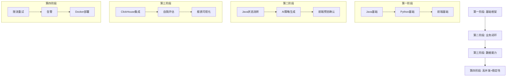

根据你的两个文档内容，我建议采用 **“分模块 + 分阶段执行”** 的方式，而不是一次性全部执行完。原因如下：

---

## ✅ 推荐方案：分模块 + 分阶段执行（3-5个阶段）

### **第一阶段：核心基础模块（MVP）**
**目标**：先把最核心的流程跑通，快速验证系统可用性
**OpenClaw执行内容**：
1. **Java后端基础框架**
   - Spring Boot项目初始化
   - MySQL + Redis 集成
   - 用户登录接口（/api/user/login）
   - 策略基础CRUD接口
2. **Python AI基础能力**
   - FastAPI服务搭建
   - DeepSeek API对接（轻量模型）
   - 指令解析demo（仅提取核心字段）
3. **前端基础界面**
   - 登录页
   - 策略列表页（静态数据）
   - 自然语言指令输入框（仅提交，不处理）

**产出**：可演示的登录+指令下发+策略查询原型

---

### **第二阶段：核心业务闭环**
**目标**：实现“指令→AI处理→策略生成→人工确认→上线”全流程
**OpenClaw执行内容**：
1. **Java后端**
   - 指令状态流转接口（/api/strategy/command/status）
   - AI策略同步接口（/api/ai/strategy/sync）
   - 策略确认上线接口（/api/strategy/confirm）
2. **Python AI**
   - 指令解析完整逻辑（含缺失字段提问）
   - AI提问回复处理（/api/strategy/command/reply）
   - 策略生成规则（基于历史数据+画像）
3. **前端**
   - 指令执行状态实时展示
   - AI策略预览页
   - 策略确认/编辑弹窗

**产出**：可完整走通一个指令从下发到策略上线的全流程

---

### **第三阶段：数据能力+优化能力**
**目标**：接入真实数据，实现策略效果评估和自动优化
**OpenClaw执行内容**：
1. **Java后端**
   - ClickHouse集成
   - 日志上报接口（/api/data/log/report）
   - 投放数据报表接口（/api/report/adData）
2. **Python AI**
   - 策略自我评估逻辑（ROI+预算偏差）
   - 成功/失败案例存储（JSON文件）
   - RAG检索规则落地（./rag/case.txt）
3. **前端**
   - 数据报表可视化（ECharts）
   - 策略效果展示
   - 告警列表页

**产出**：系统具备数据复盘和策略自我迭代能力

---

### **第四阶段：高并发+稳定性**
**目标**：生产环境可用，支撑真实投放
**OpenClaw执行内容**：
1. **Java后端**
   - 限流/降级/熔断机制
   - 重试机制（指数退避）
   - 渠道API对接（模拟）
2. **Python AI**
   - 重试/降级逻辑
   - 告警推送（/api/ai/notice/alert/push）
3. **运维**
   - Docker容器化
   - Nginx配置
   - 环境部署文档

**产出**：可直接部署到生产环境的完整系统

---

## ❌ 为什么不建议一次性全部执行完？

| 问题 | 说明 |
|------|------|
| **复杂度爆炸** | 你的文档涉及3端+2个数据库+AI+渠道API，一次性执行容易出错且难以定位问题 |
| **依赖链太长** | 前端需要后端接口，AI需要Java接口，Java需要渠道API，环环相扣，必须按顺序 |
| **调试成本高** | OpenClaw执行完才发现问题，回滚和修复成本极高 |
| **价值验证延迟** | 核心流程（指令→策略）可能要到最后才能测试，无法早期验证 |

---

## 📌 建议执行顺序（按OpenClaw任务拆分）

---

## 🧠 对OpenClaw的具体指令建议

你可以分4次向OpenClaw下发任务：

### 指令1（第一阶段）：
> 基于“智能广告投放系统”文档，帮我实现第一阶段MVP：Java后端搭建Spring Boot基础框架+用户登录接口+策略CRUD；Python搭建FastAPI+DeepSeek对接+指令解析demo；前端Vue3+登录页+策略列表+指令输入框。不需要复杂逻辑，先跑通基础结构。

### 指令2（第二阶段）：
> 在MVP基础上，实现指令状态流转、AI策略生成、前端预览确认的全流程闭环。需要Java实现/api/strategy/command/status和/api/ai/strategy/sync，Python实现指令解析+缺失提问+策略生成，前端实现状态轮询+策略预览页。

### 指令3（第三阶段）：
> 接入ClickHouse，实现日志上报和数据报表。Java集成ClickHouse+上报接口+报表接口，Python实现策略自我评估（ROI/预算偏差）+案例存储+RAG检索，前端实现ECharts可视化报表+告警列表。

### 指令4（第四阶段）：
> 增加高并发保障和部署能力。Java实现限流/降级/熔断+重试机制，Python实现重试降级+告警推送，整体Docker化+Nginx配置，输出部署文档。

---

## 🎯 总结
- **分4个阶段执行**
- **每个阶段产出可验证的成果**
- **先跑通核心流程，再叠加复杂能力**
- **最后做高并发和部署**

这样既能保证开发质量，又能让OpenClaw在每一步都能基于已有成果继续推进，避免一次性执行导致的混乱和返工。